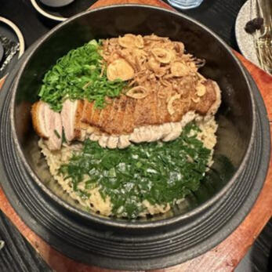
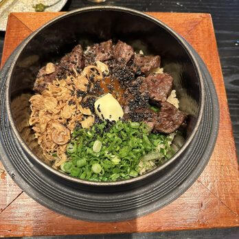
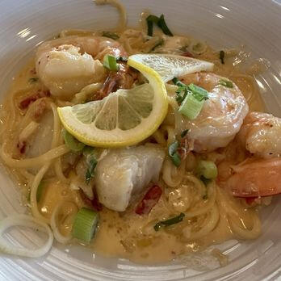
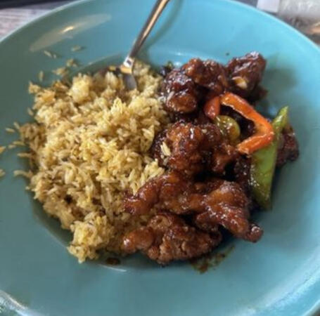
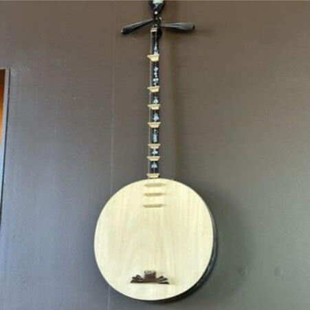
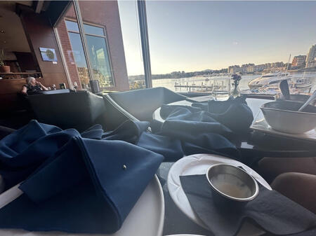

# Reviews:

**Mi Casa Mexicana: (5/5)** - *Jan 27, 2023*

I have to say, I've never been more thrilled walking into an establishment. The way the door closed behind me gave me a sense of being welcomed, like a weary traveler in a desert of hunger, being welcomed into the humble abode of an expert foodsmith. The well-filled pans clattering in the kitchen rung like the anvils of Mordor. as I received my steaming dish, I felt nothing but joy, my eyes tearing up and my mouth following in suit, making the third of these delighted senses. The salsa soaked the chips like the morning dew on a caterpillar's leaf. I came weary, left energized. came wanting, left satisfied. I came lonely, left with new friends. when I left leaving my plates empty felt as though I was leaving an old old army buddy that had tended to my wounds.

---

**Cafe Biola: (4/5)** - *Feb 15, 2023*

Café Biola can only be described as a self portrait of a misunderstood artist on their deathbed. He certainly brings something special to the plate. The chow mein was a regrettable first impression, being some incredibly unseasoned dry noodles with some seemingly freeze dried veggies. The meal had highlights, such as the delicious chocolate chip cookies, and surprisingly unique and tasty pizza. One thing I value highly is creativity in pizza slices. The salad bar was a winner, with more lines of delectable vegetables than a farmers market in Houston Texas, the farmers market center of the world. The ranch dressing was also above expectations, which in my opinion is a heavy pin to knock, in the bowling game of culinary exploration. The clam chowder was brown. The hot vegetables was incredibly disappointing, with brussels sprouts that I'm pretty sure were made partly with Styrofoam. The waffle fries were decent, I could definitely imagine enjoying them but it wouldn't blow my mind. One thing I heavily regret not trying with the sandwich assembly area, where there were a plethora of sandwich modules that you had the option to assemble. It was quite extensive, and frankly quite impressive. I could imagine eating here if I went here for college, but I think they could do better in some sections. Go Wolverines!

---

**The Fold craft pizza + kitchen: (4/5)** - *Jun 24, 2023*

You might want to sit down, because its time I share with you the fascinating experience that can be found only at "The Fold".
At the end of a long day, I feel as though their name must be indicative of the crucial folding mechanism of the figurative 700 page novel that may attempt to accurately describe the ambience of this establishment.
To call the organization of this property and its employees anything less than an ENTERPRISE would be selling short their connection with the common, beautifully ignorant, local man.

This classic rustic feeling is first found in the delicious fries that they opened with. They were crispy and delicious, with very nice sauces, one of which seemed to be house-made. Through this home made sauce, I found it difficult to reflect on the homelike aspect of this food without again imagining a vivid image of our beloved local man.

This gorgeous, local simpleton works what I can only assume to be a construction job, arriving sweat-drenched, and exhausted, at a place that simply could not feel more like home.

I see him in my minds eye, with his freshly baked pizza, comforted by the familiar flavor of a creative yet slightly overly crunchy pizza.
In my deepest corner of my heart, I imagine that all of us are... somehow connected with this imaginary, yet rugged and calloused local man, appreciating the flavor of unique pizzas, while trying to put aside the unnecessary crunchiness of the crust.

---

**Taqueria Picaro: (4/5)** - *Jun 30, 2023*

In this cruel game of trickery we call life, I feel as though I have been catfished. Like a gullible young man on a dating service, I was cheated out of the wonders I had expected from such a beautiful image. While everything looked appealing, and the ambiance was fine, the textures and flavors of the ingredients were generally disappointing.

The sauces were good, and the ingredients tasted fresh, but everything felt kind of haphazard. My best guess is that the head chef, while extremely talented, is somewhat injured, perhaps limping from one station to another in the kitchen.

The nachos were good, with some very interesting and delightful toppings, but even after ordering both kinds of possible cheeses, there was nary a strand to be found.

Some of the tacos, like the fish and shrimp were well executed and delicious. However, I have high expectations regarding Al Pastor, because it generally impresses. However, it was the downfall of the evening, being lightly bland and very dry.

At the end of the day, it feels like they are just almost there, not quite finished. They are very close to very good, but the distance they have left to cover is a crucial step in this trail.

---

**Di Fiora: (5/5)** - *Dec 16, 2023*

*sniiiiifff*...Ahhh.... just as the italian name suggests, this restaurant's flavor is delicate, and "of the flower".
Let's go back in time. In the late 1600s, Italian trade routes were expanding quickly. Almost... TOO quickly.

Let's make good use of this four-wheel-drive. As Italy experienced closer contact with the far away Europe and Asia, a cultural fusion began. Locally and universally, a flavorful fusion was born.

Let's put this baby in sport mode, shall we? if we fast forward back to our beloved 20th century, we find that through America's melting pot of cultures; flavors such as the creamy sauce of the carbonara, and the fresh kick of the Pad Kee Mao make quite the handsome couple.

Is it getting hot in here, or is that just me? Let's turn on the AC. The Italian basil roasted duck had juicy flavorful meat, and skin crispier than the well cooked skin of a duck.

Overall, a heck of a restaurant! Let's put this thing in park.

---

**Chan Seattle: (5/5)** - *Apr 26, 2024*

Nothing stings like the loss of a loved one.
However, the bittersweet burn of leaving this house of flavor-art leaves that trophy highly contested.
The marriage of all 7 corners of korea's agriculture and artistry made a tapestry mine eyes were made dull to have seen.
The wild mushrooms were nice.

The duck looked appealing on the menu, and while it was delicious, flavorful, and tender, I had expected the skin to be more prevalent and a little bit more like Peking Duck. Different culture, but still a bit of a letdown with the overall elegance of everything else.

The sot bap was delightful, and uniquely, they gave my four-year-old son a spoon and asked him to get to work stirring it.

They participate in the Seattle food fair, infrequently setting up a three course meal thing. I did not try it.

Please, oh please i beg, "release me!! release me!!!" but the darkness I am met with, unfortunately, is the light.

Like a newborn robot learning to love, I cry out to my creator, "what is this sensation?" the imprint of hatred bearing the same residuality of love...on my radiator heart.

needless to say,

I put that food down like its Old Yeller

I'm left senseless like I'm Helen Keller

she couldnt hear me but I tried to tell 'er

They cook it up here there is no one better

---

**Tsillan Cellars: (5/5)** - *Apr 28, 2024*

tsillian cellars may have won best washington wine cellar in 2020, but this very day in 2024, they won the key to my heart.

"and this is no easy task!"...my cruel and hardhearted bride of 36 years would tell you, sipping her Chateau St Michelle in her odd and ironic mason jar.

The first thing I noticed was the twisted sliver of lemon upon my pasta. It felt like a physical metaphor for both my twisted expectations of italian cuisine, and twisted love for red vines! Hahahahaha.

The scallops in my linguine were shockingly good, easily the best scallops I've ever had.

The same goes for their massive prawns, all of which were piping hot and yet tender.

The takeaway of the evening was as the old adage follows:
A dead piranha doesn't eat much.

every undertone in every dish was accented to perfection, and the main thesis statements of every dish were subtle. This created a beautiful dynamic range in the elegance of our stay, at Tsillians.

attached are a photo of aforementioned linguini, and a touching photo of Gary the snail from Nickelodeon SpongeBob SquarePants.

---

**Papaya: (5/5)** - *Jul 10, 2024*

OH WHAT A RESTAURANT!!

If teeth are the arms of the mouth, I welcome this locale with open
teeth.

If chickens are the eagles of the bird world... the crispy honey eagle with substituted fried rice was splendid.

It's not often that an old dog like me feels my heart pumping with elation for new tricks, but something about a mysterious item on the wall made THIS canine's tail wag.

it was something of a banjo/sitar halfbreed, blurring the line between American hillbillies, and India's subcontinental music scene.

The chicken was doused in honey as though bee hives had been tossed in relentlessly with reckless abandon. If my hunger prior to this delicious adventure into the world of sustainance could be compared to a dehydrated fruit, I now feel akin to a plumb bursting with juice, drenching its surroundings.

---

**Blue Crab Seafood House: (4/5)** - *Jul 16, 2024*

This is a MUST-TRY restaurant.

Many painfully mistaken people on Yelp and Google Maps alike will say that this restaurant is overhyped, or that it is harboring and hiding hundreds of extremely small french soldiers.

But the lips of those who tell and guard truth and integrity in the culinary world may remind you that many foolish Americans said the same of our beloved statue of liberty, whom hosted only 30 or so french soldiers, and they didn't even do that much!

I can only await with bated breath the beautiful day that France finally recognizes Canada for its similar valor, and awards it a similar statue.
The dishes I tried were the Lobster Pappardelle, The Romaine heart salad, and the Smash Cheeseburger.

The first thing to note is the basic bread they brought with all seafood items. It was ludicrous. It drove me and my beloved band of trained mini-horses to near insanity, all of us fainting briefly upon trying the crispy, fluffy, decadent, buttery, garlic encrusted slices.

The lobster pappardelle was a marriage of rich, tomato cream sauce, and fresh lobster and prawns. I like to imagine them all packed in an underwater club, with all the little critters dancing to barnacle songs, much like the beloved film, The Little Mermaid. Maybe instead of eating mindless creatures, relieved from a drab life by a merciful fisherman, I was eating happy shrimp, who died satisfied after a long night out.

The Romaine Heart Salad was the most interesting blend of flavors of the night. It was sweet, piercingly tangy, and somehow so intense and nuanced that words escape me. The cheese was fresh, well held up, and complimentary to the crisp leaves of romaine.

The Steamer Pot had a rich and amazing cioppeno base, and went amazingly with the mini-horse killing bread.

The ambiance of the room was complicated. The wait staff was well intentioned but disorganized. They only gave us one napkin for a party of 17 mini horses and one human, and we needed to ask for utensils. When I cut the napkin into eighteenths, suddenly I was the bad guy??? You GAVE me the napkin, with a knife INSIDE it. Most mini-horses are not meat eaters, but they were difficult when asked about the vegan options.

Upon asking for extra napkins, there was a steady stream of them, like a malfunctioning sushi conveyor belt, and by the end of the meal we couldn't even see the check under a sea of napkins. (photo attached)

---

**Taco Nazo: (5/5)** - *Sep 15, 2024*

You don't make a taco this devastating without making a few enemies, and by this logic, this authentic Mexican joint has got a lot to fear.

Notorious for their flavors, they don't hold back. 
Unfortunately, I attended this bombastic society of bold taste with a close friend, who is allergic to flavor. 
I mixed up their epi pen with a glow stick, so as they passed away, it seemed like I was inappropriately partying with the cracking of the glow stick on their leg. 
Again, I apologize for killing the vibe on September 6th, 2024.

However, the restaurant is clean, popular, and DEFINITELY worth a visit. 
While mourning a close friend, it can be nice to take refuge in an amazing burrito. The al pastor was well seasoned, and I thank Bessie for her contribution to my experience. "Mooo", I could almost hear he say, as I enjoyed the amazing rice and sauces joining her, by which the hot tortilla was packed.

Please, visit Taconazo, and honor my loss. May God be with us all.

---

**Bakers & Baristas: (4/5)** - *Oct 13, 2024*

My grandmother always told me that good food is made when the secret ingredient of love is used. This cafe uses a slightly less orthodox approach, their secret ingredient being distain and overconfidence.

However, what they lack for in reasonable mindset and grandmotherly affection, they make up for in daring, bold flavors.

I am known for my strong emotional control, yet even I can get overwhelmed by the sheer magnitude of a dish like the chicken sandwich these lowlifes gave me.

The chicken sandwich was so good that the moment it hit my tongue, I forgot my name and slouched down into my seat, my eyes rolling back into my head like a decommissioned Navy Seal under sensory lockdown.

Even now as I write this review, I write it as a husk of a man, devoid of character and meaning, living life fueled by deflated momentum.

Perhaps this review would've scraped up a fifth star if I could remember the face of my mother...oh well.

---

**Crawfish Chef Bellevue: (5/5)** - *Dec 28, 2024*

The history of American dining is one of previously reluctant ethnic inclusion, and resultant diversity in flavor palette.
Crawfish Chef in Bellevue is a true example of the adorable idea-children America bore from the Conniving French Settlers of Nova Scotia's betrothal to Louisiana. Move aside tractors and embarrassing surrenders, the south and France have something new to their names!

Honestly, one of the best restaurants i've been to, and there is DEFINITELY a memorable night in store for you if you heed my advice to check this flava partay out. wicka-wicka-word.

I pride myself on my hip language, and connection to young folk. I just get them. This restaurant, however, has classics and pioneering recipes in store for "uncs" and "jits" alike.

The crawfish was great, but much of its appeal was in its cultural value as a hillbilly classic. I say this because the organs aren't very tasty even for the bold, so eaters are relegated to the smallish tail. Flavor is like a less tender, more flavorful shrimp.

The Dungeness crab was delicious, and was cooked perfectly, coming off of shell in large, buttery clods. Call this restaurant a costco the way it be full of weirdly huge fans, like yours truly. I ordered the crab and crawfish in the impeccable immersion of an intrepid house sauce, with recognizable character rivaling Ramsay's Wellington. I wish I could buy this sauce by the tub, and bathe in it, hoping to gain even a fraction of its golden magnificence in my bones.

The shrimp was delicious, and I recommend head on, as it carries a pertinent bang/buck ratio what with the head's nice flavor. I had this in the cajun sauce, which I garunTEE will inspire hitting a reserved jig. You may not be getting LIT, per-say, but could at least be getting embered, or warmed.

"You don't know me, son!", I said intimidatingly in response to my waitress asking what spice level of the two boil sauces I wanted. Suffice it to say...I was sobbing and wailing loudly upon trying that sweet sweet sauce. The families around me stared in horror, as I molted, leaving behind my outer layer of skin and revealing my true form. Happy Crawfishing!

10/10

---

**Porter Creek Hardwood Grill: (4.5/5)** - *May 16, 2025*

"You don't find a catch [like this] without a storm weathered...", and my discovery of this restaurant offered nothing to disprove that age-old truth. What a blessing!

The particular forecasting exercise that introduced me to THIS delish spot was an emergency landing from my Delta flight, slowing to a stop in once-peaceful North Dakotan farmland. Having found such a delectable oasis, I couldn't be happier. However, I will never be able to forget holding my Miniature Lesser Dane as the life faded from his buggy eyes in that plane.

The "Herb Crusted Hanger Steak", as it is colloquially known, was fantastic. My expectation in ordering this was a middle-of-the-road cut of beef. "Hanger Steak" is not separated from the flock, so to speak, as a fancier morsel such as filet mignon or ribeye would be. However, my incorrect expectations of mediocrity dawned on me as I considered ordering it, its name on the menu revealing its lack of bourgeoisie. The "Hanger" is similar to its namesake of the gallows, doomed to a poor vibe.
However, to the chagrin of my unimpressive expectation, I shall waste no empty legislatures or literature in describing this steak as:
1: tender
2: juicy
3: incredibly flavorful when cooked medium rare, with good rendering of it's subtle marbling
4: likely from a cow

Similarly, the Brussels Sprouts with Romesco Sauce were spectacular, and I have no notes, as an apt description escapes me. I am simply not refined enough to speak on them. Too simple. I am too weak to give my commentary on them. I will never be strong enough to deserve giving you my opinion on them.
but I will say this...they were very good.

9/10, or 4 stars, as after a really good meal, the dessert (Peanut Lava Cake, and Rhubarb Pie) failed to meet the high expectations.

---

# Origin Story:
They say love at first sight doesn't exist, but my taste buds tell a different tale. It all began September 18, 1973. It was a damp autumn evening, and a neon sign illuminated the sidewalk. The wind's whisper ran through the trees as a savory aroma beckoned me. I followed, and I was led to the welcoming doors of a local restaurant. As I entered, my disposition quivered. Little did I know, the contents of my plate would fill the hole in my heart and become my life's bride. From that moment forward, I knew what I was born to do, and the rest is history. You never know what muddy clam might yield the greatest of pearls.

# Links (Some reviews taken down)
[Google Maps Reviews](https://www.google.com/maps/contrib/113423845594581218917/reviews/@40.976675,-127.1709371,5z/data=!3m1!4b1!4m3!8m2!3m1!1e1?entry=ttu&g_ep=EgoyMDI0MDkxMS4wIKXMDSoASAFQAw%3D%3D)

[Yelp Reviews](https://www.yelp.com/user_details?userid=HSqSQ_ACyAg77IJEJueavQ)
